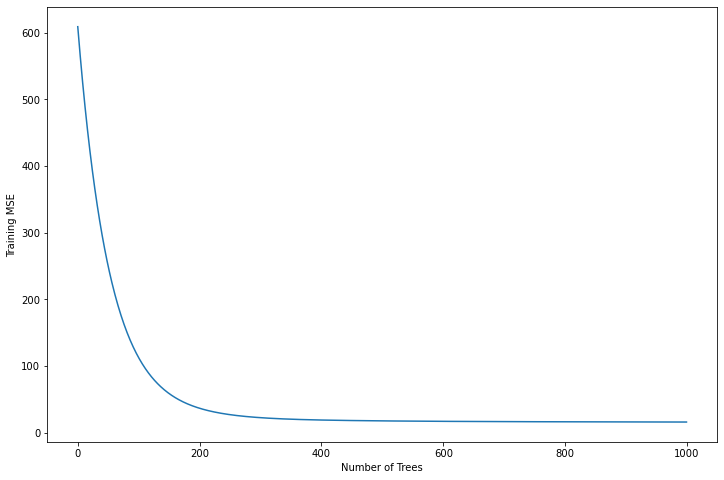

# Boosted Decision Stump

## Problem Setup

### Decision Tree
- Given an object space $X_i \in {X_1, X_2, \dots, X_n}$, the objective is to divide them into different regions $(R_j)$
- A new data-point $X_k$ is classified (predicted) by the modal (mean) value of the region it belongs to.
- The splitting rules can be summarised or presented very efficiently in a tree like data structure, which is not showcased here.


Here the `Boston` dataset is used, off which only two variables are selected as features. This is because the algorithm is quite time consuming if not programmed efficiently. The below algorithm is to build a decision stump i.e. a decision tree with only one split.

### Init Stump Variables

- Split Variable $\rightarrow$ Where the variable on which the split is made will be stored
- RSS Value $\rightarrow$ The RSS (Residual Sum of Squares) value of the split
- Split Threshold $\rightarrow$ The threshold against which the split is made
- MSE $\rightarrow$ Meean Squared Error of the split
- Predictions $\rightarrow$ Prediction value for each region

$$RSS = \sum_{j = 1}^J \sum_{i \in R_j} (y_i - y_{R_j})^2$$  
$$MSE = \frac{1}{n} RSS$$

## The Algorithm - Regression Trees

- Iterate over all feature variables
    - Calculate the `min` and `max` value of each feature
    - Generate `n` linearly spaced threshold values between `[min, max]` that will act as `thresholds`
    - Iterate over the `thresholds`
        - Split the attributes in `2-regions = [R1, R2]`, where `R1 = [feature < threshold]` and `R2 = [feature >= threshold]`
        - Calculate `RSS` for each region
        - Update the initialized variables
        
    - At the end of the iteration the initialized variables will hold:
        - An attribute of `X`
        - A `threshold` value, that divides the feature space into 2-regions based on the minimum RSS value which indicates the best split.
        - Each region will have it's corresponding prediction
    
**Note:** For a decision tree, the above steps are recursively performed for each subsequent regions, until a stopping criterion is met. This whole structure is easily represented in a tree data-structure; hence the name `decision tree`.


```python
import numpy as np
import pandas as pd
from pprint import pprint
from copy import deepcopy
from collections import defaultdict
from tqdm import tqdm
import random
random.seed(518123)
```


```python
data = pd.read_csv('Boston.csv')
```


```python
data.head()
```


<div>
<style scoped>
    .dataframe tbody tr th:only-of-type {
        vertical-align: middle;
    }

    .dataframe tbody tr th {
        vertical-align: top;
    }

    .dataframe thead th {
        text-align: right;
    }
</style>
<table border="1" class="dataframe">
  <thead>
    <tr style="text-align: right;">
      <th></th>
      <th>crim</th>
      <th>zn</th>
      <th>indus</th>
      <th>chas</th>
      <th>nox</th>
      <th>rm</th>
      <th>age</th>
      <th>dis</th>
      <th>rad</th>
      <th>tax</th>
      <th>ptratio</th>
      <th>b</th>
      <th>lstat</th>
      <th>medv</th>
    </tr>
  </thead>
  <tbody>
    <tr>
      <th>0</th>
      <td>0.00632</td>
      <td>18.0</td>
      <td>2.31</td>
      <td>0</td>
      <td>0.538</td>
      <td>6.575</td>
      <td>65.2</td>
      <td>4.0900</td>
      <td>1</td>
      <td>296</td>
      <td>15.3</td>
      <td>396.90</td>
      <td>4.98</td>
      <td>24.0</td>
    </tr>
    <tr>
      <th>1</th>
      <td>0.02731</td>
      <td>0.0</td>
      <td>7.07</td>
      <td>0</td>
      <td>0.469</td>
      <td>6.421</td>
      <td>78.9</td>
      <td>4.9671</td>
      <td>2</td>
      <td>242</td>
      <td>17.8</td>
      <td>396.90</td>
      <td>9.14</td>
      <td>21.6</td>
    </tr>
    <tr>
      <th>2</th>
      <td>0.02729</td>
      <td>0.0</td>
      <td>7.07</td>
      <td>0</td>
      <td>0.469</td>
      <td>7.185</td>
      <td>61.1</td>
      <td>4.9671</td>
      <td>2</td>
      <td>242</td>
      <td>17.8</td>
      <td>392.83</td>
      <td>4.03</td>
      <td>34.7</td>
    </tr>
    <tr>
      <th>3</th>
      <td>0.03237</td>
      <td>0.0</td>
      <td>2.18</td>
      <td>0</td>
      <td>0.458</td>
      <td>6.998</td>
      <td>45.8</td>
      <td>6.0622</td>
      <td>3</td>
      <td>222</td>
      <td>18.7</td>
      <td>394.63</td>
      <td>2.94</td>
      <td>33.4</td>
    </tr>
    <tr>
      <th>4</th>
      <td>0.06905</td>
      <td>0.0</td>
      <td>2.18</td>
      <td>0</td>
      <td>0.458</td>
      <td>7.147</td>
      <td>54.2</td>
      <td>6.0622</td>
      <td>3</td>
      <td>222</td>
      <td>18.7</td>
      <td>396.90</td>
      <td>5.33</td>
      <td>36.2</td>
    </tr>
  </tbody>
</table>
</div>


## Building a Decision Stump

- Decision Stump is a decision tree with only one split. A simple model with a very high **Bias**.

```python
def decision_stump(features, labels, num_thresholds=200):
    
    # Init Stump Variables
    stump = {'split_variable': "",
             'split_threshold': None,
             'rss_split': None,
             'mse_split': np.inf,
             'split_predictions': {'lower': None, 'higher': None}}
    
    # Iterate over all feature variables
    for column in features.columns:
        # Calculate the `min` and `max` value of each feature
        min_threshold, max_threshold = features[column].min(), features[column].max()
        
        # Generate `n` linearly spaced threshold values between `[min, max]` that will act as `thresholds`
        thresholds = np.arange(min_threshold, max_threshold, step=(max_threshold-min_threshold)/(num_thresholds-1))
        
        # Iterate over the `thresholds`
        for threshold in thresholds:
            # Split the attributes in `2-regions = [R1, R2]`, where `R1 = [feature < threshold]` and `R2 = [feature >= threshold]`
            less_than_idx = (features[features[column] < threshold]).index
            greater_than_idx = (features[features[column] >= threshold]).index
            
            # Calculate Predictions for each region
            pred_less_than = labels.loc[less_than_idx].mean()
            pred_greater_than = labels.loc[greater_than_idx].mean()
            
            # Calculate RSS
            RSS = ((labels.loc[less_than_idx] - pred_less_than)**2).sum() + ((labels.loc[greater_than_idx] - pred_greater_than)**2).sum()
            
            # Update stump attributes
            mse = (RSS / len(labels)).values[0]
            
            if stump['rss_split'] is not None:
                if mse < stump['mse_split']:
                    stump.update({'split_variable': column,
                                  'split_threshold': threshold,
                                  'rss_split': RSS.values[0],
                                  'mse_split': mse,
                                  'split_predictions': {'lower': pred_less_than.values[0],
                                                        'higher': pred_greater_than.values[0]}})
            else:
                stump.update({'split_variable': column,
                                  'split_threshold': threshold,
                                  'rss_split': RSS.values[0],
                                  'mse_split': mse,
                                  'split_predictions': {'lower': pred_less_than.values[0],
                                                        'higher': pred_greater_than.values[0]}})
    return stump
```


```python
indexes = data.index.to_list()
random.shuffle(indexes)

split_pc = 0.8   # 80-20 split of train & test
split_num = int(len(indexes) * split_pc)
train_idx, test_idx = indexes[:split_num], indexes[split_num:]
```


```python
X_train, X_test = data.loc[train_idx, 'rm lstat'.split()], data.loc[test_idx, 'rm lstat'.split()]
Y_train, Y_test = data.loc[train_idx, ['medv']], data.loc[test_idx, ['medv']]
stump = decision_stump(X_train, Y_train)
pprint(stump)
```

    {'mse_split': 45.601216341880786,
     'rss_split': 18422.891402119836,
     'split_predictions': {'higher': 37.52898550724637,
                           'lower': 20.074925373134317},
     'split_threshold': 6.913869346733658,
     'split_variable': 'rm'}


## Predicting using Decision Stump


```python
def stump_predict(features, decision_stump):
    
    less_than_idx = (features[decision_stump['split_variable']] < decision_stump['split_threshold'])
    greatere_than_idx = (features[decision_stump['split_variable']] >= decision_stump['split_threshold'])
    
    predictions = np.zeros(len(features))
    
    predictions[less_than_idx] = decision_stump['split_predictions']['lower']
    predictions[greatere_than_idx] = decision_stump['split_predictions']['higher']
    
    return predictions
```


```python
test_mse = ((Y_test.values.reshape(-1) - stump_predict(X_test, stump))**2).sum()/len(Y_test)
print(f"Test MSE: {test_mse:>5.4f}")
```

    Test MSE: 49.4678


## Boosted Stump

We have a decision stump and we can perform predictions using it. But as we can see that MSE value is quite large. This can be minimized by using a Boosted Tree.  

The primary goal of Boosting is to take a model with very high bias and slowly increase it's complexity (variance) by fitting the same model but the target variable is the residuals. The mathematical calculations are shown below:

$$
\begin{align}
r_i & = Y_i & \dots\text{Initial Residuals} \\
r'_i & = r_i - \hat{f}(X_i) * \eta & \dots \text{$\hat{f}$ = decision stump} \\
\hat{f_b}(X) & = \sum_{b = 1}^{B} \eta \hat{f_b}(x) = \eta * \sum_{b = 1}^{B} \hat{f_b}(x) & \dots \text{Final Prediction using all the decision stumps fitted to the residuals} \\
&& \text{As $\eta$ is constant we can pull it out, compute the sum and then perform the product.}
\end{align}
$$

Some popular implementations available are Adaboost and XGBoost.  

Things required to build a boosted tree:

- A decision stump
- Learning Rate $(\eta)$, generally kept as $\eta = 0.01$
- Number of Boosted Trees $(B)$

<span style="color:red;font-weight:500;font-size:20px">
    🚨Crucial: Residual Calculations.
    It should be noted that we are trying to fit the residuals.
    <p>This will be again used during predictions.</p>
</span>


```python
def printf(message):
    tqdm.write(message)
```


```python
def boosted_prediction(features, boosted, lr = 0.01, max_idx=None):
    
    # Create an array equal to the length of the features filled with zeros
    preds = np.zeros(len(features))
    
    # Convert the boosted dict into data frame
    # Not completely necessary, but acts as a sanity check making sure each key has the same number of items
    boosted = pd.DataFrame(boosted)
    
    if max_idx is not None:
        boosted = boosted.head(max_idx)
    
    # As stated earlier we're looping over each row from the top.
    # we could've essentially looped through the range of length(boosted)
    # and considered the index of each key.
    for index, row in boosted.iterrows():
        preds += stump_predict(features, row)
    
    # Final predictions multiplied with the learning rate (eta) according to the above equation
    return preds * lr
```


```python
def boosted_stump(features, labels, lr = 0.01, boosted_num = 10, verbose=False):
    
    # Initialize the necessary variables
    # We'll need a residual variable which we'll be updating multiple times
    # Initially the residuals will be same as the original labels
    # The boosted stump will be returned as a table, where each row is a decision stump
    # We'll keep a track of the training MSE which we'll later use for plotting
    """
    residuals = r_i + 
    """
    residuals = deepcopy(labels)
    boosted = defaultdict(list)
    training_mse = []
    
    # Looping through the range of decision stumps
    for tree_num in tqdm(range(boosted_num), ascii=True, dynamic_ncols=True, desc="Fitting Boosted Tree"):
        
        # Fit the features with the residuals
        stump = decision_stump(features, residuals)
        # Get predictions on the same features using the stump
        predictions = stump_predict(features, stump)
        
        # Calculate the residuals by substracting the predictions multiplied by the learning rate (lr)
        predictions = pd.DataFrame((predictions * lr), index=residuals.index, columns=residuals.columns)
        residuals = residuals - predictions
        
        # Update the boosted dictionary
        boosted['split_variable'].append(stump['split_variable'])
        boosted['split_threshold'].append(stump['split_threshold'])
        boosted['rss_split'].append(stump['rss_split'])
        boosted['mse_split'].append(stump['mse_split'])
        boosted['split_predictions'].append(stump['split_predictions'])
        
        # Calculate Boosted predictions and log the training MSE
        train_preds = boosted_prediction(features, boosted)
        train_preds = pd.DataFrame(train_preds, index=labels.index, columns=labels.columns)
        train_MSE = (((labels - train_preds)**2).sum()  / len(labels)).values[0]
        if verbose:
            printf(f"{tree_num+1:>2} Training MSE: {train_MSE:>5.4f}")
        training_mse.append(train_MSE)
    
    boosted["training_mse"] = training_mse
    
    return boosted
```


```python
learning_rate = 0.01
boosted_tree_num = 1000
```


```python
boosted = boosted_stump(features=X_train, labels=Y_train, lr=learning_rate, boosted_num=boosted_tree_num)
```

    Fitting Boosted Tree: 100%|###############################################################| 1000/1000 [19:18<00:00,  1.16s/it]


```python
boosted_df = pd.DataFrame(boosted)
boosted_df.head()
```


<div>
<style scoped>
    .dataframe tbody tr th:only-of-type {
        vertical-align: middle;
    }

    .dataframe tbody tr th {
        vertical-align: top;
    }

    .dataframe thead th {
        text-align: right;
    }
</style>
<table border="1" class="dataframe">
  <thead>
    <tr style="text-align: right;">
      <th></th>
      <th>split_variable</th>
      <th>split_threshold</th>
      <th>rss_split</th>
      <th>mse_split</th>
      <th>split_predictions</th>
      <th>training_mse</th>
    </tr>
  </thead>
  <tbody>
    <tr>
      <th>0</th>
      <td>rm</td>
      <td>6.913869</td>
      <td>18422.891402</td>
      <td>45.601216</td>
      <td>{'lower': 20.074925373134317, 'higher': 37.528...</td>
      <td>608.885037</td>
    </tr>
    <tr>
      <th>1</th>
      <td>rm</td>
      <td>6.913869</td>
      <td>18422.891402</td>
      <td>45.601216</td>
      <td>{'lower': 19.874176119402957, 'higher': 37.153...</td>
      <td>597.675689</td>
    </tr>
    <tr>
      <th>2</th>
      <td>rm</td>
      <td>6.913869</td>
      <td>18422.891402</td>
      <td>45.601216</td>
      <td>{'lower': 19.675434358208992, 'higher': 36.782...</td>
      <td>586.689407</td>
    </tr>
    <tr>
      <th>3</th>
      <td>rm</td>
      <td>6.913869</td>
      <td>18422.891402</td>
      <td>45.601216</td>
      <td>{'lower': 19.478680014626896, 'higher': 36.414...</td>
      <td>575.921752</td>
    </tr>
    <tr>
      <th>4</th>
      <td>rm</td>
      <td>6.913869</td>
      <td>18422.891402</td>
      <td>45.601216</td>
      <td>{'lower': 19.28389321448058, 'higher': 36.0501...</td>
      <td>565.368373</td>
    </tr>
  </tbody>
</table>
</div>


## Analysis


```python
import matplotlib.pyplot as plt
%matplotlib inline
```


```python
plt.figure(figsize=(12, 8))
plt.plot(boosted_df['training_mse']);
plt.ylabel('Training MSE');
plt.xlabel('Number of Trees');
```


    

    


Now we'll look at how the test mse is changing with high number of boosted trees.


```python
test_mse = []
for max_idx in range(boosted_tree_num):
    predictions = boosted_prediction(X_test, boosted, lr = 0.01, max_idx=max_idx)
    test_preds = pd.DataFrame(predictions, index=Y_test.index, columns=Y_test.columns)
    test_MSE = (((Y_test - test_preds)**2).sum()  / len(Y_test)).values[0]
    test_mse.append(test_MSE)
```


```python
zipped = zip(iter(np.array(test_mse) > boosted_df['training_mse'].values), range(len(test_mse)))

for condition, idx in zipped:
    if condition:
        first_idx = idx
        break
```


```python
plt.figure(figsize=(20, 12))
plt.plot(boosted_df['training_mse'], label='Training MSE');
plt.plot(test_mse, label='Test MSE');
plt.ylabel('MSE');
plt.xlabel(f'Number of Trees {boosted_tree_num}');
plt.plot(first_idx, test_mse[first_idx], marker='X', color='r', markersize=20)
plt.legend();
```


    

    


From the above plots it is evident that Boosted Trees have a high bias when the number of trees is small, but with gradual increase of the number of trees that fits the residuals we are increasing the model complexity i.e. variance.

The boosted trees do over-fit the training data, indicated by the red-cross where the `TEST MSE` crosses the `TRAIN MSE`, but that happens at a very slow ratee, that too by a very small margin.
